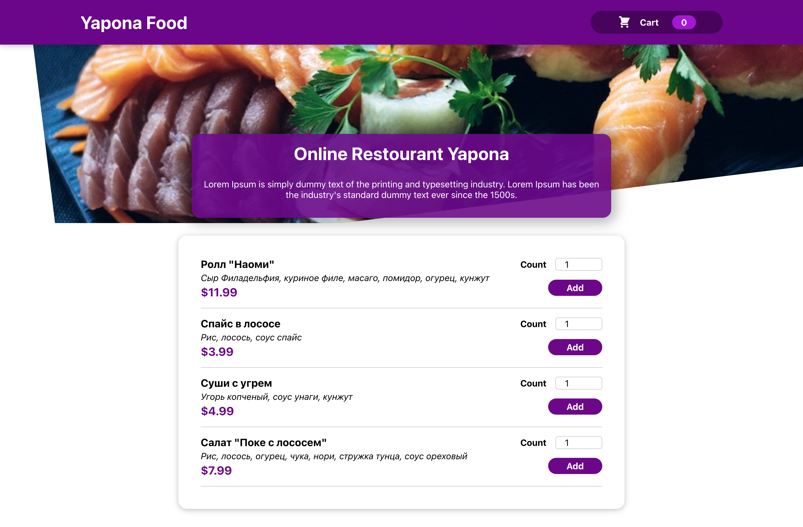

# Yapona sushi

This is an educational project developed as part of the [React.js Сourse 2022](https://www.udemy.com/course/react-np/) Created by YouRa Allakhverdov.

## Table of contents

- [Overview](#overview)
  - [Screenshot](#screenshot)
  - [Link](#link)
  - [Built with](#built-with)
- [Author](#author)

## Overview

### Screenshot

### Link

- Live Site URL: [yapona.igorc.site](https://yapona.igorc.site/)

### Built with

- Semantic HTML5 markup
- CSS custom properties
- Flexbox
- CSS Grid
- Mobile-first workflow
- [React](https://reactjs.org/) - JS library

## Author

### Chorniy Igor

- [Website](https://igorc.site/)
- [Upwork Profile](https://www.upwork.com/freelancers/~01c5afe5dda1df0850)
